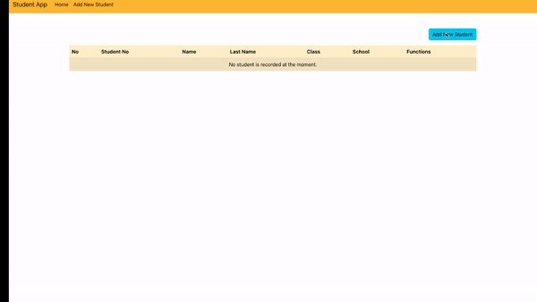

# Student App 

## An app for school administration or as a teacher helper

### 

* Bootstrap for styling,
* Json-server as backend data storage,
* React router dom as window.location properties:
    - useNavigation, Link, useParams, BrowserRouter, Routes, Route as hooks
* axios in order to post, get, delete data to json-server,
* 

#### Enjoy screen gif

